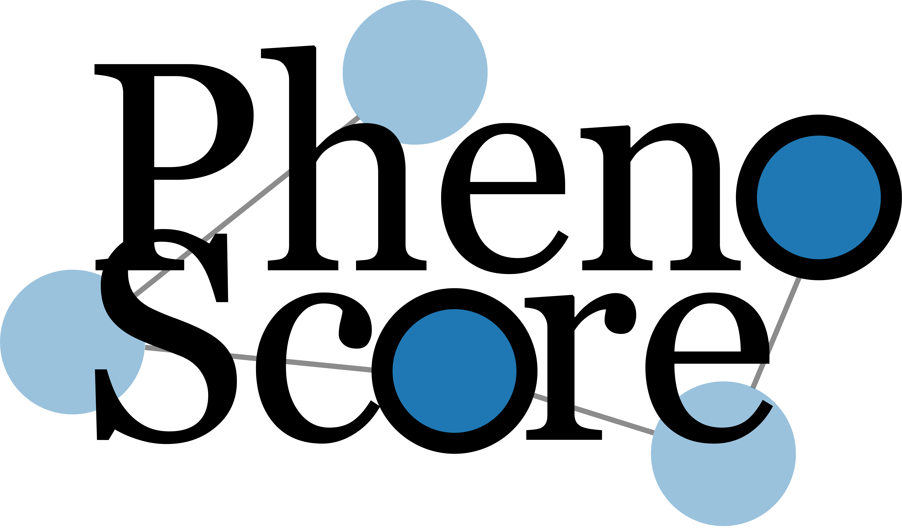

#### Reproducing figures and results from the internship report "Pheno-OptiLIME: faithful Local Interpretable Model-agnostic Explanations for phenotypic data"

The data is not publicly available, but the code is in `notebooks\Reproduce_figures_and_results.ipynb`.

# PhenoScore
 
PhenoScore is an open source, artificial intelligence-based phenomics framework that combines facial recognition technology with Human Phenotype Ontology (HPO) data analysis to quantify phenotypic similarity at both the level of individual patients as well as of cohorts.

# Installing PhenoScore

To install PhenoScore using conda, it is advisable (but not strictly necessary) to create a new environment first:

`conda create -n PhenoScore python=3.9`

Then, activate the environment

`conda activate PhenoScore`

Install the needed dependencies using the requirements file:

`pip install -r requirements.txt`

If you get a ``numpy`` error, reinstall ``numpy`` because of some compatibility issues, with:

`pip uninstall numpy`

`pip install numpy==1.23.5`

# Optional:
To use the GPU (about a 10x performance increase when doing the LIME predictions) when CUDA is installed:

`conda install cudnn`

# Running PhenoScore

To run the basic example analysis (looking at the two subgroups in _SATB1_), take a look at the tutorial in the ``notebooks`` directory. 

